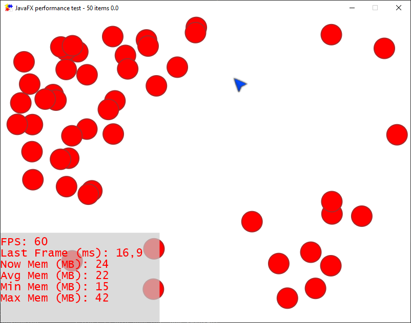
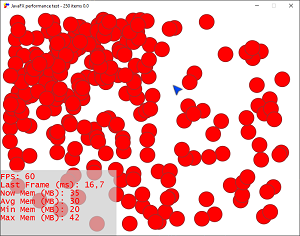
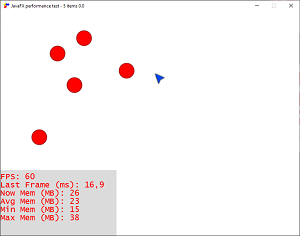

# JavaFX performance test using FXGL

Based on this blog post ["Getting started with FXGL game development"](https://webtechie.be/post/2020-05-07-getting-started-with-fxgl/)

By providing a number argument, the number of dots can be defined at startup. Default value is 50.

